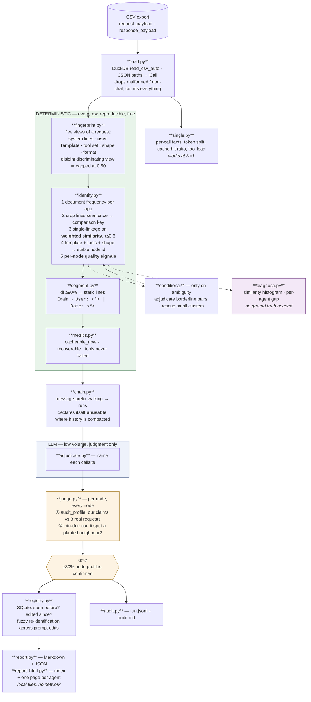
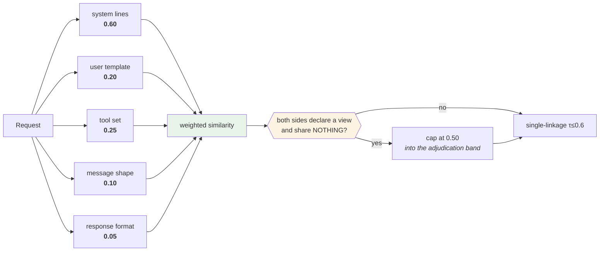
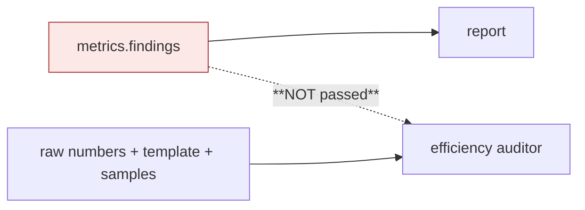

# Architecture — what is actually implemented

A map of the code as it stands, including the parts that are weak. Written to be checked against
the source, not to flatter it.

---

## End to end



**The rule:** LLM output never silently influences a deterministic measurement. Judgments are
applied through named functions and land in the audit trail. Enforced by `tests/test_separation.py`.

**Scope:** this profiles; it does not optimise. The auditors and optimisers were deleted —
findings hung on a grouping we could not yet trust are worse than none, because they are
confidently wrong. See `STRESS_FINDINGS.md` for what the adversarial corpus caught.

---

## Identity — no longer the system prompt alone

The first version keyed on the system prompt only. That merged any two callsites sharing a base
template (proven: two collided in the fixture) and collapsed everything for agents whose real
work is in the user turn.



Two behaviours worth knowing:

- **Weights renormalise** over the views that apply. A callsite with no tools is not penalised
  for having none — the tool view is dropped rather than scored zero.
- **Weak-prompt fallback.** When the prompt is ≤3 lines ("You are a helpful assistant."), the
  prompt weight drops to 0.24 and tools/shape/format are boosted. Without this, every callsite
  behind a generic prompt merges into one node.

Node ids hash **template + tool set + shape**, so two callsites sharing a template but differing
in tools no longer collide.

---

## Verification — per node, adversarial

The earlier gate sampled 9 of 56 nodes and asked *"do these belong together?"* — a leading
question that left 47 nodes unexamined. Replaced with two tests on **every** node:

| test | what it is shown | what a failure means |
|---|---|---|
| **audit_profile** | our stated claims — template, dynamic fields, purpose, "these are one callsite" — plus 3 real requests | the profile is not true of its own data |
| **intruder** | medoid + a genuine member + one request from the **nearest competing node**, shuffled | if it cannot find the outsider, that boundary is not real |

Verdicts: `confirmed` · `profile_wrong` · `impure` · `boundary_weak`. The gate needs ≥80%
confirmed. **Failures are reported, never silently corrected.**

Measured on the fixture: **49/56 confirmed, 3 profile_wrong, boundary test 100% correct over 46
nodes.** The three flags were real — it caught the v1/v2 prompt edit in `app_agent` and the
per-step state block in `app_supervisor` being wrongly called static.

---

## Judging quality without ground truth

Production has no answer key, so `diagnose.py` computes the evidence instead. The decisive
picture is the **pairwise similarity histogram**: two humps with the threshold in the gap means
the callsites are real; one smear means the threshold is slicing a continuum.

```
score      same callsite                 different callsite
0.05-0.10  ..........................    ##########################
0.40-0.45  ..........................    ####......................
0.60-0.65  ..........................    ..........................  <- threshold
0.65-0.70  ##############............    ..........................
0.90-0.95  ###############...........    ..........................

gap +0.400   (p10 within - p90 across)     worst -0.120  (closest single pair)
```

Two corrections were needed before this picture could be believed:

- It recomputed similarity from the **raw** line sets, not the noise-filtered keys the grouper
  actually compared. The histogram described a comparison that never happened.
- The headline was `min(within) - max(across)`. Single linkage joins a node through a chain, so
  one weak pair drags the minimum to the floor: an agent grouping at purity **1.000** and
  completeness **1.000** was labelled `OVERLAP`. The bulk figure (p10 vs p90) is the headline
  now, with the worst case beside it rather than instead of it.

Per node, also computed with no truth: `min_internal` (weakest link), `nearest_other` (closest
competing node), `margin`, `distinct_ratio`, `template_lines` → verdict `ok` / `weak` / `suspect`.

---

## Which surface each stage reads

Three definitions of "the request" are in use. This is deliberate but worth knowing:

| surface | definition | used by |
|---|---|---|
| **identity** | prompt lines + tools + shape + format | grouping, node ids |
| **prose** | system + all user turns | segmentation, static/dynamic |
| **whole request** | tool schemas + every message, wire order | `cacheable_now`, judge evidence |

**Fixed.** `recoverable` used to subtract a prose-derived number from a whole-request-derived
one, so stable tool schemas inflated the prefix and clamped the result to zero — 49 of 56
callsites declared tools and exactly one reported anything. Both sides are now whole-request
quantities: `recoverable = (static prose + static tool schemas) − cacheable_now`, with tool
schemas counted only where the tool list never varies. On the hard corpus it now reports 7,514
recoverable tokens on the callsite that has them, worth 751,400 tokens across the export.

---

## Output layout

One directory per run. Per **agent**, not per run: a single page was fine for six agents and
will not survive a few hundred, where it becomes a document nobody scrolls and the browser lays
out every callsite to show one.

```
out/run-<id>/index.html      the estate ranked by tokens, with a `recoverable` column
out/run-<id>/<agent>.html    one agent, standalone, sendable to the team that owns it
out/run-<id>/report.md       the same in prose
out/run-<id>/report.json     the summary, for pipelines
out/run-<id>/calls.duckdb    every grouped request, and the static/dynamic verdict per line
```

## Checking the profile instead of believing it

`report.json` used to list each callsite's `request_ids` but not the requests, so a group could
not be opened. `store.py` writes `calls.duckdb`: `calls` (every request with its callsite and
raw payloads), `nodes`, `regions`, and **`region_lines`** — every line of every region marked
static or dynamic with the document frequency behind the call.

`region_lines` is the table that matters. *"This line is in 100 of 100 requests so we called it
template; that one is in 1, so we called it payload"* is a claim anyone can check with a
`SELECT`, and disagree with.

```
python inspect_calls.py                        list every callsite
python inspect_calls.py --node app_platform:fe80    regions, static lines, dynamic lines
python inspect_calls.py --node ... --call 0    one real request, each line marked = or ~
python inspect_calls.py --sql "SELECT ..."     anything else
```

## Anatomy, not role shape

`role_shape` ("SU") is a **clustering feature**. It was also shown to the reader, where it says
nothing — sixty calls with one system and one user message describes most of an estate. It is
now in the detail pane only, and the headline is the request's anatomy: how it divides into
instructions / tool schemas / user turn / history, and which of those hold still.

Two errors were corrected on the way:

| | |
|---|---|
| stability judged on **token count** | a RAG payload is the same length every call and entirely different text — 9,546 tokens were reported as "the same every call". Now judged on line-level content per region. |
| region shares against `avg_request_tokens` | different estimator from the regions themselves; one callsite's shares totalled **114%**. Now taken against the regions' own sum. |
| static share summing distinct dynamic lines across the node | fell as the export grew rather than describing the request. Now per call. |

Measured on the 6-agent corpus: index 9 KB, agent pages 8-52 KB, against 97 KB for the single
page it replaces.

## Throughput

Sending 266k prompt tokens — nine minutes of quota at 30k TPM — took **5.75 hours**, because the
client walked into 55 rate limits and slept 20–70s over each, plus 52 connection errors each
waiting out a 90s timeout.

Fixed by pacing instead of reacting:

- **`RateLimiter`** — per-model token budget over a rolling 60s window, checked *before* sending
- **per-model budgets** — the bulk tier has ~6x the headroom; one shared budget throttled it to
  the frontier model's limit for no reason
- **45s timeout** instead of 90s
- **judge runs on the bulk model** — checking stated claims against evidence does not need the
  frontier model

Result: **107 forced retries → 0.** The hard corpus now runs end to end in ~90s for ~$0.06.

---

## Where the deterministic findings go



The auditor gets the numbers but not the **conclusions** the deterministic layer reached, so it
re-derives them and its findings read generic. Still a gap.

---

## Thresholds and the evidence behind each

| threshold | value | evidence |
|---|---|---|
| similarity τ | 0.6 | **measured** — 0.7 splits a callsite in two, 0.8 into five |
| noise filter | df ≥ 2 | **measured** — a higher threshold deletes what distinguishes a small callsite |
| node floor | max(3, 2% of rows) | **measured** — a fixed 20 hid 38 of 56 callsites |
| fingerprint weights | .60/.20/.25/.10/.05 | **judgement, unvalidated** — no sweep has been run |
| disjoint-view cap | 0.50 | **measured** — without it a router and executor merge at 0.75 |
| user-turn df floor | 5% of app calls | **measured** — a floor of 2 shattered a 144-call callsite into 24 |
| re-identification τ | 0.70 | judgement — deliberately stricter than clustering |
| chain orphan alarm | 30% | **measured** — compacting agents sit at 88%, replaying agents near 0 |
| cache finding | recoverable > 50 tok | judgement |
| gate | 80% confirmed | judgement |

---

## Implemented vs not

| | |
|---|---|
| load · single-call · fingerprint · grouping · quality signals · stable ids · segmentation · metrics | **implemented** |
| per-node judge (profile audit + intruder) · gate | **implemented** |
| **run reconstruction (chain)** + honest unusable verdict | **implemented** |
| **registry** — memory across runs, re-identification across prompt edits | **implemented** |
| **`match.py`** — one request → which known callsite (containment, anchor index) | **implemented**, no caller yet |
| **hard corpus + `stress.py` scorer** | **implemented** |
| `diagnose.py` histogram + per-agent gap | **implemented** — now scores the filtered keys |
| **`report_html.py`** — index + one page per agent, token and cache bars | **implemented** |
| conditional adjudication / residual rescue | implemented; **now shown the whole request** |
| efficiency + security auditors · consolidation | **removed** — see the scope note in `pipeline.py` |
| cache rewrite · compression · output optimisation | **removed** |
| fingerprint weight tuning | **not done** |
| anything measured on a real export | **not done — the gap that matters** |
